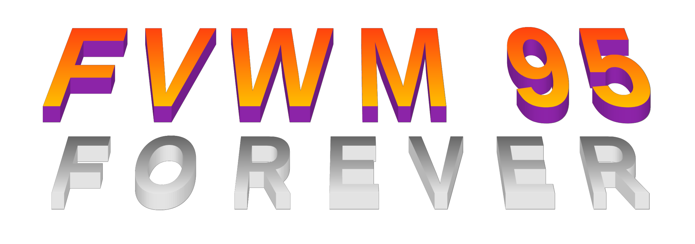

## Overview

Fvwm95 Forever is a maintained fork of
[Fvwm95](https://fvwm95.sourceforge.net/).  Fvwm95 was a hack of
[Fvwm](https://www.fvwm.org/) that was intended to look and feel more like
Win95.  Fvwm is a traditional window manager for
[X11](https://en.wikipedia.org/wiki/X_Window_System).

Fvwm95 supports a rich set of customizable gestures without a complex
interface.  Window controls can respond differently depending not just on
which mouse button was pressed but on whether it was a click, double click,
mash, or drag.  That capability is sorely missed in other window managers.

The last release of Fvwm95 was in 2003.  Some serious bugs have been fixed in
this fork, but many less serious ones have not, and subsequent developments
from the original parent package Fvwm have not been merged.

## Modules

Fvwm95 consists of a base window manager plus a collection of modules.  There
are several groups of modules that all provide similar functions.

Functions                      | Modules
---                            | ---
List and switch windows        | FvwmIconBox FvwmIconMan FvwmTaskBar FvwmWinList
Provide buttons that do things | FvwmButtons FvwmScript FvwmTaskBar FvwmWharf
Command prompt for Fvwm95      | FvwmConsole FvwmTalk
Preprocess config files        | FvwmCpp FvwmM4
Generate config files          | FvwmSave FvwmSaveDesk
Create GUIs                    | FvwmForm FvwmScript

All of the modules that provide buttons have the ability to "swallow" an app
or another module, which causes the app or module to appear as a button or
widget within the module that swallowed it.

More detailed summaries of the individual modules follow.

Module | Summary
---    | ---
FvwmAudio | Nominally:  Window events trigger sound effects.  Actually:  Window events trigger anything you want.
FvwmAuto | Configurable autoraise function.
FvwmBacker | Nominally:  Set different backgrounds on different desktops.  Actually:  Changing desktops triggers anything you want.
FvwmBanner | Nominally:  Display an Fvwm logo for 3 seconds.  Actually:  Display any pixmap you want for as long as you want.
FvwmButtons | Button bar to launch programs or run commands.  Supports merging adjacent buttons (widthxheight option) and nested containers of buttons.
FvwmConsole | Enter Fvwm commands interactively in an XTerm with readline support.
FvwmConsoleC | N/A, this is a back-end piece of FvwmConsole that you don't run directly.
FvwmCpp | Preprocess Fvwm commands or config files through cpp.
FvwmDebug | Log window manager chatter to stderr.
FvwmForm | A way to create and use interactive dialogs in an Fvwm config file.  Simpler and less general than FvwmScript.
FvwmIconBox | A box with icons for all windows; configurable click/key actions.
FvwmIconMan | One or more lists of windows with configurable click actions and the ability to sort different apps onto different lists.
FvwmIdent | Click on a window to get details like name, class, resource, window ID, width, height, etc.
FvwmM4 | Preprocess Fvwm commands or config files through m4.
FvwmPager | Show desktops, pages, and viewport in miniature; click to move among them.
FvwmSave | Create a file called new.xinitrc that purports to reconstruct the current desktop layout if pasted into ~/.xinitrc.
FvwmSaveDesk | Create a file called .fvwmdesk that purports to reconstruct the current desktop layout if pasted into ~/.fvwm95rc.
FvwmScript | Easily build dialogs or arbitrary graphical applications.  The example script Buttons provides yet another implementation of what is done by FvwmButtons, FvwmTaskBar, and FvwmWharf.
FvwmScroll | Click on any overlarge window to put it inside a viewport with scrollbars.
FvwmTalk | A more primitive version of FvwmConsole that runs in its own window and doesn't use libreadline.
FvwmTaskBar | Imitation of Windows 95 task bar.  Supports Start button, configurable click actions, and "goodies" including date, battery status, email, and user-defined quick launch icons.
FvwmWharf | A cousin of FvwmButtons.  Does not support merging adjacent buttons or containers, but it does support "slide-out" drawers of additional buttons.  Untested/unmaintained support for OffiX Drag and Drop and audio features was saved to docs/modules/FvwmWharf.
FvwmWinList | A list of windows with configurable click actions.

## Installation

Fvwm95 Forever is an eternal release, which means there will be no formal
releases.  Downstream package maintainers should use the date of the last
commit for tracking purposes.

Clone the repo or download the GitHub-generated zip file and build it as
follows:

    autoreconf --install
    ./configure
    make -j 4
    make install

See the INSTALL file that autoreconf drops for general help on using
configure.

## Customization

Customization is accomplished by creating a user file .fvwm95rc or by
modifying the system-wide system.fvwm95rc.  Consult the man page for fvwm95,
the installed system.fvwm95rc, and other documentation provided in the
distribution for details.  Beware that described syntax can be out-of-date
with respect to the source code.

The included sample config file permits a reasonable demo of all modules
except the preprocessors.  See the modules' man pages for further options.

## History

[Fvwm95](https://fvwm95.sourceforge.net/) began when [Hector Peraza and David
Barth](https://www.fvwm.org/fvwm-ml/16071.html) forked
[Fvwm](https://www.fvwm.org/) version 2.0.41b in 1996.

The changelog shows that Fvwm95 was worked on by Emmanuel Rouat in 1998, then
again by Hector Peraza from 2001 to 2003.  The Fvwm95 page on SourceForge is
still there, but it was last updated in 2001, and the last release was
fvwm95-2.0.43f dated 2003-05-04.

Dave Flater forked fvwm95-2.0.43f in 2010 and made a series of releases on
[his own web site](https://flaterco.com) designated fvwm95-2.0.43f-dwf1
through fvwm95-2.0.43f-dwf8.  In 2026, he renamed the fork to Fvwm95 Forever
and moved it to GitHub.

The READMEs that were included in fvwm95-2.0.43f can be found under the docs
subdirectory.  They describe additional, older layers of forking, cloning,
and hacking.

Click the link to list [other forks of
Fvwm95](https://github.com/search?q=fvwm95&type=repositories) currently on
GitHub.

## Bugs

### Fvwm95 bugs

- Many functions have not been tested and can be assumed to be faulty.
- The FvwmScript example scripts have not been tested or debugged much and
are more broken than not.
- Fvwm95 and every one of its modules can be crashed or sent into an infinite
loop with bad input (a bad config file, bad arguments, or a bad script for
FvwmScript).  There is very little input validation.
- Windows swallowed by FvwmTaskBar don't receive mouse clicks.  The task bar
uses passive grabs and does not forward the events to them.
- FvwmTaskBar often reports BadDrawable and BadPixmap.
- Swallowed windows going away is not handled properly.
- Swallowed apps may persist after the parent module goes away.
- The icon substituted for the missing small.calc.next.xpm referenced by the
Buttons script is too small.
- FvwmButtons ignores the sizes of swallowed windows.  This is documented
behavior (see Size option) but surprising.
- Autohide often clobbers attempts to move or resize the task bar.
- If page-flipping is enabled at the same time as autohide, it can be
impossible to unhide the task bar without flipping down a page.
- Autohide sometimes loses its alarm and won't hide the task bar until the
user mouses over it.
- When a mail or lock check goody becomes invisible while a tip is showing,
subsequent tip windows might be blanked out.
- The coordinate fudging in ShowDateModule is fragile and font-specific.

### SDL bugs

SDL2 introduced a regression in how SDL implements fullscreen mode with
non-EWMH (non-NetWM) window managers.  Apps like Stella and EDuke32 that used
to work fine with Fvwm95 and SDL1 now get fouled up when going fullscreen.

The following workaround worked for SDL2:

1.  `export SDL_VIDEO_X11_LEGACY_FULLSCREEN=0`

2.  Add a Style command to ~/.fvwm95rc to remove all decorations from the app:  
    `Style "stella"  NoTitle, NoHandles, BorderWidth 0`  
    `Style "eduke*"  NoTitle, NoHandles, BorderWidth 0`

SDL3 is yet to be tested, but it's a bad sign that the identifier
SDL_VIDEO_X11_LEGACY_FULLSCREEN doesn't appear in the sources.

### X server and intel_drv bugs

The following occurred with X.Org X Server 1.18.3, Intel integrated graphics
chipsets module version 2.99.917, and Linux kernel version 4.10.10, module
DRM_I915.  It might be totally irrelevant for current configurations.

With Intel Skylake CPU integrated graphics, mini-icons get corrupted on
screen when GoodyModule is used.  The problem does not reproduce with the
vesa or nvidia drivers, or even with older Intel graphics.  Nevertheless, it
is possible that there is a corrupting fault in the goodies code that is
simply masked by other drivers.

Resizing the task bar can trigger lock-ups and crashes of the X server, its
module for Intel integrated graphics (intel_drv.so), and the GPU itself.
Arguably, it is always *their* problem if they lock up or crash, but
FvwmTaskBar might be misbehaving as a client.

## To do

For planned changes and accepted wish list items, see the [Issues
tab](https://github.com/DaveFlater/Fvwm95-Forever/issues) of the GitHub repo.

The code quality is low.  The goal of this fork was to stabilize Fvwm95, not
rewrite it or duplicate later work on Fvwm.  As a result, the following
quality issues were punted:

- The command syntaxes used for the same functions in different modules are
gratuitously different from one another.  They should be standardized.
- There is a lot of semi-duplicated clone-and-hack code among the modules.  The
least faulty implementations should be pulled up and shared.
- The entire thing should be rebuilt using standard classes or templates for
lists, maps, containers, parsers, etc.  All of the one-off code is buggy and
inconsistent.
- FvwmTaskBar should be further cleaned up to eliminate redundant redraws and
allow swallowed windows to receive mouse clicks.
- Any number of mouse buttons should be supported.
- All inputs should be validated to prevent crashes.
- All functions should be tested and debugged.
- All printed messages should be made accurate and consistent.
- All embedded version strings and datestamps in source code and man pages
should be reset and harmonized.
- Man pages should be revised and cleaned up.
- The icons collection should be cleaned up, deduplicated, and modernized.
- The substitutions that are so hard to do in configure.ac supposedly should
be done by make.
